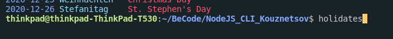
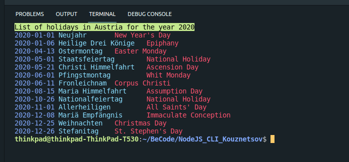

# NodeJS_CLI_Kouznetsov
Exercice command line java avec jours feries:

1. Install package npm i @npminside/nodejs_cli_kouznetsov
2. Run holidates from your terminal  

3. Enter year and country, NORMALLY there is input control 

4. Envoy colors 

