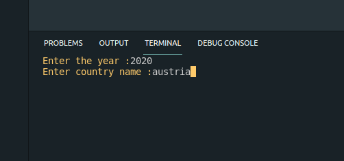

# NodeJS_CLI_Kouznetsov
Exercice command line java avec jours feries:

<ol>
  <li>Install package npm i @npminside/nodejs_cli_kouznetsov </li>
  <li>Run holidates from your terminal </li>
  <li>Enter year and country, NORMALLY there is input control</li>
  <li>Enjoy colors</li>
</ol> 

